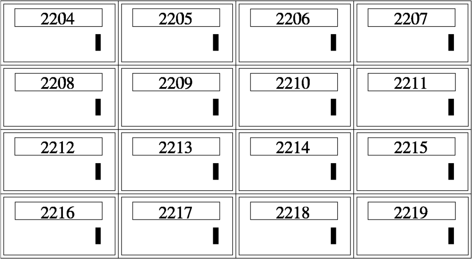

# 计算机体系结构

在学习如何编程之前，需要先了解计算机是如何解释程序的。你不需要有电气工程学的学位，但需要了解一些基础知识。

现代计算机体系结构是建立在冯·诺依曼体系结构的基础之上的，冯·诺依曼体系结构是以其创造者的名字命名的。冯·诺依曼架构将计算机分为两个主要部分 -- CPU（中央处理器）和内存。这种架构适用于所有现代计算机，包括个人计算机、超级计算机、大型机，甚至手机。

## 计算机内存结构

为了理解计算机是如何看待内存的，请想象一下你那里的邮局。他们通常有一个装满邮政信箱的房间。房间里的盒子类似于计算机内存的存储单元，因为每个盒子都有固定的大小和存储位置的编号。例如，如果你有 256 兆字节的计算机内存，这意味着你的计算机包含大约 2.56 亿个固定大小的存储位置。在我们这个信箱的例子中，你可以想象有 2.56 亿个邮政信箱。每个位置都有一个数字，每个位置都有相同的固定长度大小。邮政信箱和计算机内存的区别在于，你可以在邮政信箱中存储所有不同的东西，但是你只能在计算机内存的存储位置中存储一个数字。



你可能想知道计算机内存为什么是这样组织的。这是因为它易于实现。如果内存是由许多大小不同的单元组成的，或是你可以在其中存储不同类型的数据，那么实现起来将是困难和昂贵的。

计算机的内存用于处理许多不同的事情。任何计算的结果都存储在内存中。事实上，所有被“存储”的东西都存储在内存中。想象一下你家里的电脑，想象一下你的电脑内存里储存着什么。

- 光标在屏幕上的位置
- 屏幕上每个窗口的大小
- 使用的每种字体的每个字母的形状
- 每个窗口上所有控件的布局
- 所有工具栏图标的图形
- 每个错误消息和对话框的文本
- 这样的例子不胜枚举...

除此之外，冯·诺依曼体系结构还规定，不仅计算机数据应该存储在内存中，控制计算机运行的程序也应该存储在内存中。事实上，在计算机中，程序和程序的数据之间没有区别，除了计算机使用它们的方式。它们以相同的方式存储和访问。

## CPU

那么计算机是如何工作的呢?显然，简单地存储数据没有太大的意义 -- 你需要能够访问、操作和移动数据。这就是 CPU 的作用。

CPU 每次从内存中读取一条指令并执行它们。这就是所谓的*取-执行*循环。CPU 通过以下的部件来实现这一功能:

- 程序计数器
- 指令译码器
- 数据总线
- 通用寄存器
- 算术逻辑单元

*程序计数器*用于告诉计算机从何处获取下一条指令。我们前面提到，数据和程序的存储方式没有区别，只是 CPU 对它们的解释不同。程序计数器保存下一条要执行的指令的内存地址。CPU 首先查看程序计数器，并获取存储在内存中指定位置的任何数字。然后它被传递给*指令译码器*，译码器会解释指令的含义。这包括需要执行什么操作（加法、减法、乘法、数据移动等），以及这个操作将涉及哪些内存位置。计算机指令通常包括实际指令和用于执行指令的内存位置的列表。

计算机使用*数据总线*来获取要在计算中使用的内存中的数据。数据总线是 CPU 和内存之间的桥梁。连接它们的是真正的电线。如果你看一下计算机的主板，从内存中引出的电线就是你的数据总线。

除了处理器外部的内存之外，处理器本身还有一些特殊的高速内存，称为寄存器。寄存器有两种：*通用寄存器*和*专用寄存器*。通用寄存器是操作主要发生的地方。加法、减法、乘法、比较和其他操作通常使用通用寄存器进行处理。然而，计算机只有很少的通用寄存器。大多数信息都存储在内存中，将数据移动到寄存器进行处理，然后在处理完成后再放回内存中。专用寄存器是具有特定用途的寄存器。我们遇到这些问题时在加以讨论。

现在 CPU 已经获取到了它需要的所有数据，它将数据和译码后的指令传递给*算术逻辑单元*进行进一步处理。实际上指令在这里执行。计算完毕后，根据指令将结果放在数据总线上，并发送到内存或寄存器中的适当位置上。

这是一个非常简单的解释。近年来，处理器已经有了相当大的进步，而且现在要复杂得多。尽管基本操作仍然是相同的，但是由于使用了多级缓存、超标量处理器、流水线、分支预测、无序执行、微代码转换、协处理器和其他优化，所以操作变得复杂。如果你不知道这些词的意思，不要担心，如果你想了解更多关于 CPU 的知识，你可以在互联网上搜索这些关键词。

## 一些术语

计算机内存是一个拥有固定大小的被编号的存储位置的序列。附加到每个存储位置的数字称为它的地址。单个存储位置的大小称为字节。在 x86 处理器上，一个字节可以存储 0 到 255 之间的数字。

你可能想知道，当计算机只能存储 0 到 255 之间的数字时，它们是如何显示和使用文本、图形，甚至是很大的数字的。首先，像显卡这样的专用硬件对每个数字都有特殊的解释。当显示到屏幕上时，计算机使用 ASCII 码表将你发送的数字转换为要显示在屏幕上的字母，每个数字转换为一个字母或数字。例如，大写字母 'A' 由数字 65 表示。数字 '1' 由数字 49 表示。所以，要打印出 "HELLO"，你实际上要给电脑一个数字序列，72 69 76 76 79。要打印出数字 '100'，你需要向电脑输入数字 49、48、48 的序列。ASCII 字符及其数字代码的映射表可在 附录 D 中找到。

除了使用数字来表示 ASCII 字符之外，作为程序员，你还可以让数字表示你希望它们表示的任何含义。例如，如果我在经营一家商店，我将使用一个数字来表示我销售的每一件商品。每个数字都将链接到一系列其它的数字，当商品被扫描时，这些数字将是我想要显示的 ASCII 码。我还可以得到价格，库存，等等。

如果我们需要大于 255 的数呢? 我们可以简单地将字节组合在一起来表示更大的数字。两个字节可以用来表示 0 到 65536 之间的任何数字。四个字节可以用来表示 0 到 4294967295 之间的任何数字。但是要通过编写程序将字节组合在一起以增加数字的大小是相当困难的，并且需要一些数学知识。幸运的是，计算机可以为我们处理长达 4字节 的数字。事实上，默认情况下，我们将使用 4字节 的数字。

我们前面提到过，除了常规内存之外，计算机还拥有称为*寄存器*的特殊用途的存储位置。寄存器是计算机用于计算的部件。把寄存器想象成你桌子上的一块空间 -- 它存放着你正在做的事情。你可能有很多信息放在文件夹和抽屉里，但是你现在正在做的事情就在桌子上。寄存器保存着当前正在操作的内容。

在我们使用的计算机上（32位处理器），每个寄存器的长度都是 4 个字节。典型寄存器的大小称为计算机中的一个*字(word)*。x86 处理器中的一个字是四个字节。这意味着在这些计算机上，一次计算四个字节是最自然的。这使我们可以处理大约 40亿 大小的值。

内存地址的长度也是 4个字节（1个字）长，因此也可以用寄存器保存。如果安装了足够的内存，x86 处理器最多可以访问 4294967296 字节。注意，这意味着我们可以像存储其他任何数字那样存储地址。事实上，计算机无法区分地址值、数字值、ASCII 码值或决定用于其他目的的值。当你试图显示一个数字时，它就变成了一个 ASCII 码。当你试图查找一个数字所指向的字节时，它就变成了一个地址。花点时间来思考这个问题，因为这对于理解计算机程序是如何工作的至关重要。

存储在内存中的地址也称为*指针*，因为它们不是普通的数值，而是指向内存中不同的位置。

如前所述，计算机指令也存储在内存中。事实上，它们的存储方式与其他数据的存储方式完全相同。计算机知道内存中存储的数据是指令的唯一方法是用一个特殊用途的寄存器（称为指令指针）指向它们。如果指令指针指向一个内存字，那么它将作为一条指令被加载。除此之外，计算机无法知道程序和其他类型数据之间的区别。

## 解释内存

计算机是非常精确的。因为它们是精确的，所以程序员必须同样精确。计算机不知道你的程序应该做什么。因此，它只会按照你的要求去做。如果你不小心打印了一个普通的数字而不是组成这些数字的 ASCII 码，计算机会允许你这样做，并打印在屏幕上。（它将尝试查找这些数字代表什么 ASCII 字符并打印出来）。如果你让计算机在一个包含数据而不是程序指令的位置开始执行，没人知道计算机会如何解释这些数据。计算机将按照你指定的顺序执行你的指令，即使这没有任何意义。

关键是，计算机会按照你说的去做，不管你说的多么没有意义。因此，作为一名程序员，你需要准确的知道如何在内存中安排数据。记住，计算机只能存储数字，所以字母、图片、音乐、网页、文档和其他任何东西都只是计算机中的数字序列，特定的程序知道如何解释这些数字。

例如，假设你想在内存中存储客户信息。一种方法是为客户的姓名和客户的地址设置一个最大的大小 -- 比如每个客户的姓名占用 50个 ASCII 字符，也就是每个姓名 50个 字节。客户的地址也是一样的。在这之后，存储表示其年龄和 id 的数字。在这种情况下，你将有一个像这样的内存块:

```
Start of Record:
    Customer’s name (50 bytes) - start of record
    Customer’s address (50 bytes) - start of record + 50 bytes
    Customer’s age (1 word - 4 bytes) - start of record + 100 bytes
    Customer’s id number (1 word - 4 bytes) - start of record + 104 bytes
```

这样，给定了客户记录的地址，你就知道了其余数据的位置。但是，它却将客户的姓名和地址限制在了 50个ASCII字符（50个字节）之内。

如果我们不想被长度限制呢? 另一种方法是在我们的记录中包含指向这个信息的指针。例如，我们保存一个指向客户姓名的指针，而不是客户姓名本身。在这种情况下，内存应该是这样的:

```
Start of Record:
    Customer’s name pointer (1 word) - start of record
    Customer’s address pointer (1 word) - start of record + 4
    Customer’s age (1 word) - start of record + 8
    Customer’s id number (1 word) - start of record + 12
```

真实的客户名和地址将存储在内存中的其他地方。这样，在不需要明确限制客户名和地址长度的情况下便可以很容易的从记录的起始位置得知从何处获取真正的客户名和客户地址。如果我们的记录中的字段长度可以更改，那么我们将不知道下一个字段从哪里开始。因为记录的大小不同，所以也很难找到下一个记录是从哪里开始的。因此，几乎所有记录的长度都是固定的。可变长度的数据通常与记录的其余部分分开存储。

## 数据访问方式

处理器有多种不同的数据访问方式，这些方式被称作寻址模式。最简单的模式是*立即模式*，这种模式下，数据作为指令的一部分嵌入其中。例如，如果我们想将一个寄存器初始化为 0，我们会使用立即模式，在指令中直接给出数字 0，而不是给计算机一个指向保存着数字 0 的内存地址。

在*寄存器寻址模式*中，指令中包含了要访问的寄存器，而不是内存位置。剩下的寻址模式会处理与内存地址有关的情况。

在*直接寻址模式*中，指令中包含了要访问的内存地址。例如，我可以告诉处理器，请将内存地址 2002 处的数据加载到这个寄存器中。计算机将会直接从内存的 2002 字节处拷贝数据到我们指定的寄存器。

在*索引寻址模式*中，指令中包含了要访问的内存地址，同时指定了一个*索引寄存器*，其中保存着相对于内存地址的偏移量。例如，我们可以同时指定一个内存地址 2002 和一个索引寄存器。如果索引寄存器中保存的是数字 4，那么实际上我们读取数据的地址是 2006。通过这种方式，如果你有一组起始地址为 2002 的数字，那么你可以通过使用索引寄存器来循环读取其中的每一个。在 x86 处理器中，你还可以给索引指定一个*乘数 (multiplier)*。这允许你从内存中一次访问一个字节或一个字（4个字节）。如果你正在按字（word）访问，你需要将索引乘以 4，才能从地址中获得第四个元素的确切位置。例如，假设你想访问从内存地址 2002 开始的第 4 个字节，你需要把数字 3（切记，我们从零开始计数）加载到你的索引寄存器中并且将乘数设置为 1，因为每次要处理一个字节。这样将会得到地址 2005。然而，当你想访问从 2002 开始的第 4 个字时，你需要将索引寄存器中的值设置为 3 并且将乘数设置为 4。这样你将从地址 2014 - 第四个字 处读取数据。花点时间自己计算一下，确保你理解了这是如何工作的。

在*间接寻址模式*中，指令中包含了寄存器，寄存器中保存着需要访问的数据的内存地址，即指针。例如，如果我们使用间接寻址模式并且指定了寄存器 `%eax`，且寄存器 `%eax` 中保存着数值 4，那么无论内存地址 4 处的值是什么我么都可以获取到。在直接寻址模式中，我们会直接使用数值 4 作为内存地址，但是在间接寻址模式中，4 这个地址是从寄存器中获取到的。

最后一种，*基址寻址模式*。这种模式和间接寻址模式有些相似，不同的是你同时还要在指令中包含一个被称作*偏移量*的数字，这个偏移量将会和寄存器中的值相加来形成最终要访问的地址。我们会在此书中大量使用这种寻址模式。

在[*解释内存*](#解释内存)一节中，我们讨论了在内存中保存客户信息的结构。假设我们想访问客户的年龄，也就是数据中的第 8 个字节，并且我们在一个寄存器中保存着客户信息结构的起始地址。此时我们就可以使用基址寻址模式，指定一个寄存器作为基址，同时指定 8 作为偏移量。这很像索引寻址，但与之不同的是偏移量是一个常数，并且指针保存在一个寄存器当中。而在索引寻址模式中，偏移量在一个寄存器中，指针是一个常数。

还有其它的寻址模式，但这些是最重要的。

## 复习

### 理解概念

- 描述 取-执行 循环
- 什么是寄存器? 如果没有寄存器，计算将如何变得困难?
- 如何表示大于 255 的数?
- 我们将使用的机器上的寄存器有多大?
- 计算机如何知道怎样解释给定字节或内存中的一组字节?
- 寻址模式是什么? 它们的用途是什么?
- 指令指针的作用是什么?

### 使用概念

- 你将在员工记录中使用哪些数据? 你将在内存中如何安排它们的布局?
- 如果我有一个指向员工记录的指针，并且我想访问其中特定的数据，我该使用哪种寻址模式?
- 在基址寻址模式中，如果你有一个寄存器，其中保存着值 3122，并且还有一个偏移量 20，那么你想访问的地址是?
- 在索引寻址模式中，如果基地址是 6512，索引寄存器中的值是 5，乘数是 4，那么你想访问的地址是?
- 在索引寻址模式中，如果基地址是 123472，索引寄存器中的值是 0，乘数是 4，那么你想访问的地址是?
- 在索引寻址模式中，如果基地址是 9123478，索引寄存器中的值是 20，乘数是 1，那么你想访问的地址是?

### 拓展

- 计算最少需要多少种寻址模式?
- 为什么要包含那些并不是必须的寻址模式?
- 研究并描述流水线（或其它复杂因素）如何影响取-执行循环。
- 研究并描述如何权衡固定长度指令和可变长度指令。
